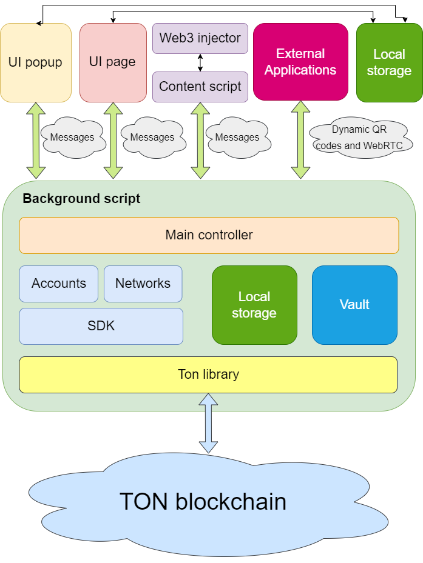
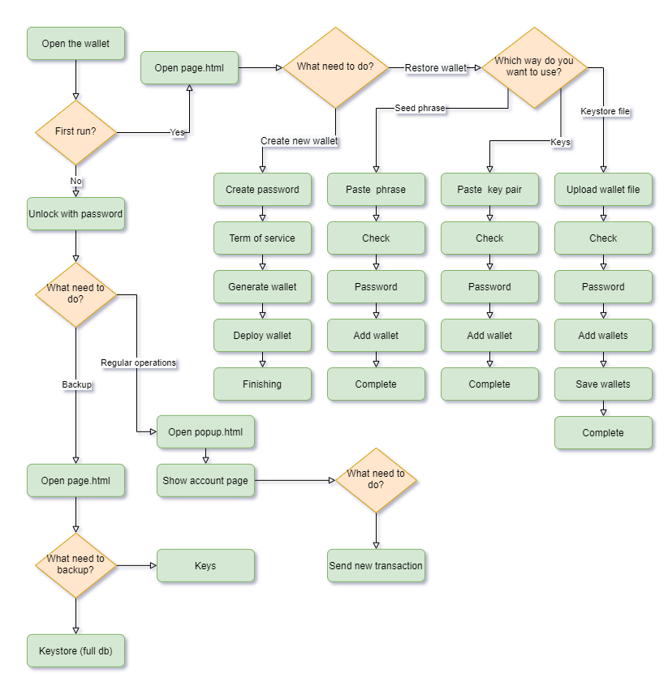

# XTON wallet

<div align="center">
  
</div>

This repository contains source code for web-extension that allow interaction with TON (The Open Network) blockchain from your web browser.

# Security

* Wallet keys decrypt only when needs and via in-memory password, that stores in the one variable
* IndexedDb stores only common information, like transaction history, etc.
* Key pair is encrypted with AES-GCM
* Password checking is provided by the comparison of a random hex key with length 256 that is stored in indexedDb and its encrypted hash that was obtained by AES-GCM with password inclusion. In this case to get master password needs to decrypt encrypted data that must be equal to the hex string by 256 length
* Code develops accordance with [state-of-the-art security standards](https://developer.chrome.com/docs/extensions/mv3/security/)

# Browser supporting

* Chrome [install](https://docs.xtonwallet.com/installation)
* Edge [install](https://docs.xtonwallet.com/installation)
* Safari [install](https://docs.xtonwallet.com/installation)
* Opera [install](https://docs.xtonwallet.com/installation)
* Firefox [install](https://docs.xtonwallet.com/installation)

# Architecture

## Application



## User flow



# Tests

Testing system is based on [selenium](https://www.selenium.dev/) and [mochajs](https://mochajs.org/) for e2e testing and [testing-library](https://testing-library.com/docs/svelte-testing-library/intro) for components

To test need to run:

```bash
yarn run test
```

# Technical stack

* [rollup.js](https://rollupjs.org/guide/en/) for building processes
* [svelte.js](https://svelte.dev/) for javascript framework
* [chota](https://alexxnb.github.io/svelte-chota) for style
* [idb](https://www.npmjs.com/package/idb) for internal db
* [webextension-polyfill](https://github.com/mozilla/webextension-polyfill) for cross browser supporting
* [gulp.js](https://gulpjs.com/) for building distributives for browsers
* [selenium](https://www.selenium.dev/) for e2e testing
* [testing-library](https://testing-library.com/docs/svelte-testing-library/intro) for component testing

# Contribution

Anyone can participate in contribution. Pull request (PR) is welcome.

# License

This repository provides by [Apache License 2.0](LICENSE)

# Distribution and mode for developers

To prepare environment need to run:

```
yarn install
```

To run developer mode:

```
yarn start
```

To prepare build need to run:

```
yarn run build
```

This command will generate a zip file for each browser.

For local the development process you can find comfortable to have [MyLocalTon](https://github.com/neodiX42/MyLocalTon)

# Documentation

All documentation you can find by this [link](https://docs.xtonwallet.com)

# Translations

For now the extension is available on the followed languages:
* English
* Arabic
* Amharic
* Bulgarian
* Bengali
* Catalan
* Czech
* Danish
* German
* Greek
* Spanish
* Estonian
* Persian
* Finnish
* Filipino
* French
* Gujarati
* Hebrew
* Hindi
* Croatian
* Hungarian
* Indonesian
* Italian
* Japanese
* Kannada
* Korean
* Lithuanian
* Latvian
* Malayalam
* Marathi
* Malay
* Dutch
* Norwegian
* Polish
* Portuguese (Brazil)
* Portuguese (Portugal)
* Romanian
* Russian
* Slovak
* Slovenian
* Serbian
* Swedish
* Swahili
* Tamil
* Telugu
* Thai
* Turkish
* Ukrainian
* Vietnamese
* Chinese (China)
* Chinese (Taiwan)

If you are native speaker on any other language and can help with translation, please use this file as [source](/src/assets/i18n/en.json)

# Steps for a new release

* Run tests

```
  yarn run test
```

* Create a commit with a description

* Increase a version in package.json and manifest.json and update [CHANGELOG](CHANGELOG.md) file

```
  npm version [<newversion> | major | minor | patch | premajor | preminor | prepatch | prerelease [--preid=<prerelease-id>] | from-git]
```

Usually after common commit needs to use `patch`

```
  npm version patch
```

* Create builds for browsers

```
  yarn run build
```

# Requested features

- [x] Multi accounts
- [x] DApp connector for the signing transactions, the signing messages, the encrypt/decrypt messages
- [x] Adding tokens and interactions with them
- [x] Supporting of easy conversion between currencies
- [x] TON proxy supporting
- [x] NFT supporting
- [ ] TON DNS supporting
- [ ] Mobile version for IOS/Android platforms with the same functionality as in browsers
- [ ] Full SDK supporting
- [ ] Qr codes for the payment system via the mobile version (the payment sending, ask payment, the deep link)
- [ ] Onboarding library for Dapp for the quick installation of the web extension or the mobile version
- [ ] TON Payments supporting
- [ ] TON Storage supporting
- [ ] Swipe operations
- [ ] DEX supporting
- [ ] Buying on external exchanges
- [ ] Creating multisign wallet (many owners, requirement count more than 0)
- [ ] Hard wallet supporting
- [ ] Fishing blacklist with the voting process on TON blockchain
